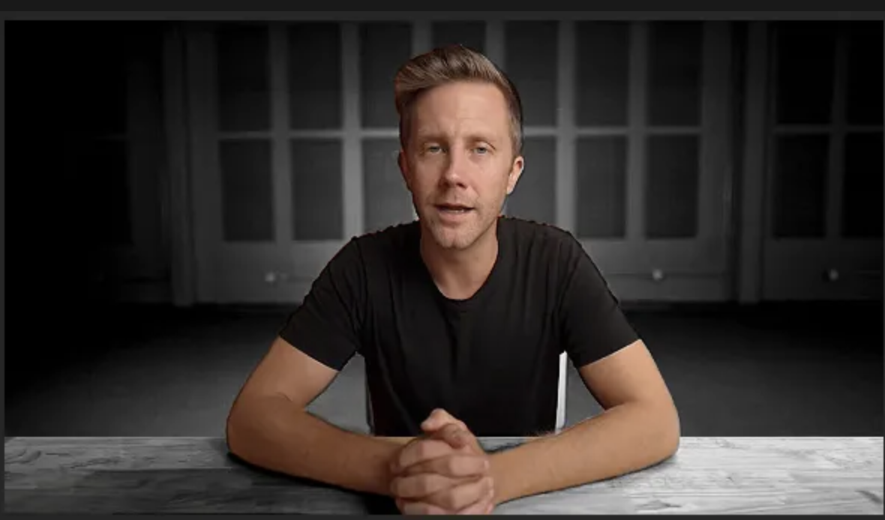

# Technical Assessment

> Video Background Filter
> 

<aside>
💡

You can find the starting point repository [here](https://github.com/Vastly-Podcasts/Technical-Assessment)

</aside>

## Objective

Create a system that applies a background video filter while leaving the speaker unaffected. Specifically:

- **Background**: Apply a video effect (black and white, sepia, etc.)
- **Speaker/Person**: Keep in full color

### Example

*Notice here how the background is black and white but the speaker is in color*

## Task Overview

You will implement a video processing system that can distinguish between a person (foreground) and the background in a video, applying different visual effects to each region.

## Technical Requirements

### Core Functionality

1. **Person Detection**: Identify the speaker/person in the video
2. **Background Segmentation**: Separate the person from the background
3. **Selective Filtering**: Apply grayscale filter to background only
4. **Real-time Display**: Let the user view the processed video in real time.

### Suggested Technical Approach

We recommend using a lightweight face detection model or selfie segmentation model, but you're free to use any approach you prefer:

## Technical Architecture

### Backend (`/app`)

A python flask app where you will find a Hello World boilerplate. Run [`main.py`](http://main.py) to start the backend server locally.

### Frontend (`/frontend`)

A react front end with a video placed in the center. Follow the instructions in [`README.md`](http://README.md) to run the frontend. There is a Hello World function already created 

## Rules

None. Use any software/AI/tool you wish to help you accomplish this. Consistent with the job, the final output is all I am concerned with. *However,* I will ask you questions about functionality and you are always expected to understand your implementation and any shortcomings. 

As this is a role for a product engineer, both the frontend and backend are equally important. Consider the user experience.

## Submission Guidelines

### Required Deliverables

1. **Working Code**: Fork this repo and send over a link to the final Fork when finished
2. **Documentation**: README with any instructions if additional work is needed to test it on my end

## Time Expectations

- **Minimum Implementation**: 2-3 hours

I will want to see that you spent time on both the frontend and backend and considered the user experience deeply. An exceptional candidate will finish in time and consider adding additional functionality, UI, or otherwise go above and beyond.

## Expansion Ideas

If time permits, here are some fun ideas to expand if you wish:

- Add a gallery of different filters to select from
- Let me choose timeframes when the filters apply / remove
- Add a cool UI for experiencing the video: theater, through a window, video editor etc.
- Allow me to upload any video
- Any other video editing or analysis using openCV + ffmpeg

*If you get stuck, wrestle with the problem. We aren’t interested in engineers who already know everything - we’re need engineers who have a figure-it-out mindset.*